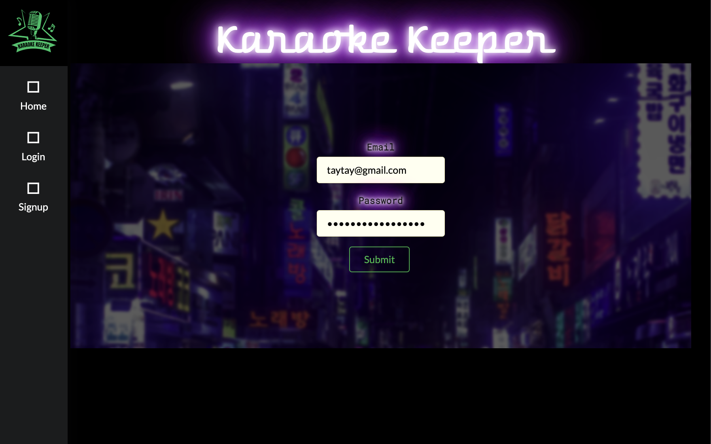
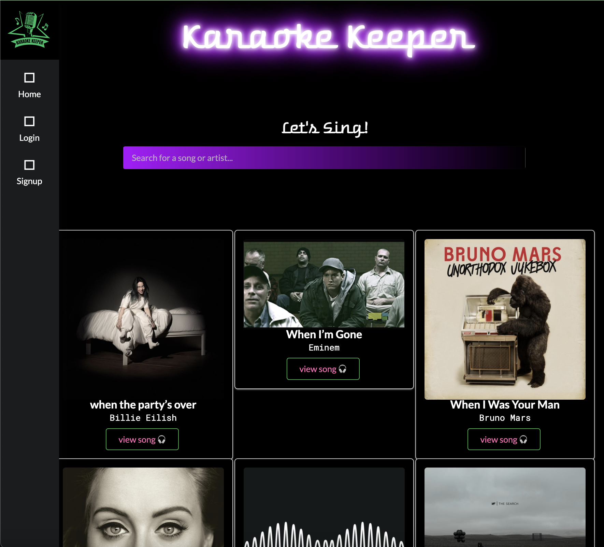
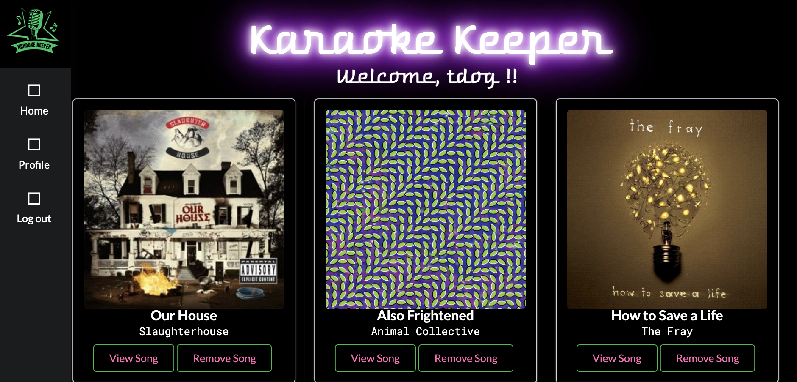

# Karaoke-Keeper

## Karaoke Keeper is your one stop shop for your go-to karaoke songs!

Our motivation for creating Karaoke Keeper was our own experiences as avid karaoke goers. There was a need for a platform to keep and track all ones Go-To songs, especially when out on the town, and feeling overwhelmed by the endless selection of song options available.

Our Karaoke keeper allows users to search for their favorite songs, view the lyrics, and add songs to their karaoke profile. Future development will include categorization of songs for particular themed nights, and the ability to add comments to songs, in order to note how they went or parts you still need to practice.

## Table of Contents

- [Installation](#installation)
- [Usage](#usage)
- [Credits](#credits)
- [License](#license)
- [Questions](#questions)

## Installation

In order to use this application, you will simply follow the link to visit our deployed page. Once there, you will need to create a username, enter your email, and create a password. Once logged in, you can start documenting all your karaoke songs from the URL here:
[Karaoke Keeper](https://karaoke-keeper-02062b1867b9.herokuapp.com/)

## Usage/Tests

Navigating our interface is simple, in order to create your karaoke playlist, you must create an account and sign in. Once you have a login, you can search for your Go-To songs. When you find a song you know and love, add it to your profile so you can reference it and the lyrics later.
The process should look something like this:

## Contributing

The collaborators on this project include:

- [Taylor Sullivan](https://github.com/tayskully)
- [Wayne Chen](https://github.com/wayne80361)
- [Fatima Minhas](https://github.com/fatimaminhas)
- [Freddy Quito ](https://github.com/Fmquito45)

Tutorials followed include Columbia University Coding Bootcamp 2023, as well as:

- [Github Docs](https://docs.github.com/en)
- [developer mozilla](https://developer.mozilla.org/en-US/)
- [Dev.to](https://dev.to/)
- [W3 Schools](https://www.w3schools.com/)

Special thanks to Ben Wright and Max Ohsawa for the guidance! You're the Best!

## License

    MIT License

## Questions

Reach out to us if you have any questions!

- Emails:
- taysully94@gmail.com
- f.minhas394@gmail.com
- wayne80361@gmail.com
- Fmquitox45@gmail.com

---

## Badges

      

 
